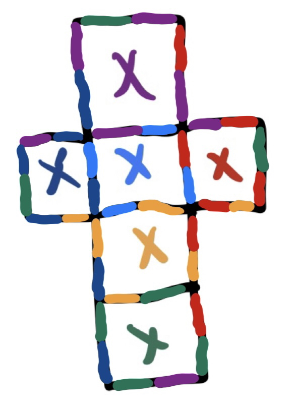
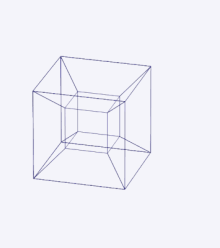
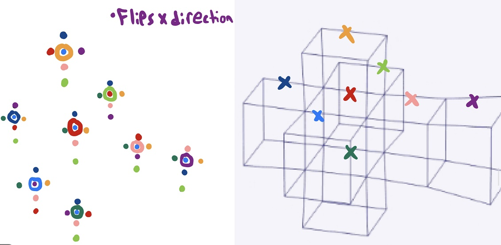

# Tesseract

Tesseract is an esoteric programming language designed to run code on a 4D hypercube.
Inspired by Ethan Muchnik's Cube: https://github.com/EthanMuchnik/Cube-Language-Interpreter.
Tesseract can run it's own file type '.tes', as well as cube's '.cube' & '.dewy' natively
by converting a cube file into a tesseract. 

Like its predecessors, tesseract is run on a 2d grid (in this case its a 2d representation
of a tesseract). A cursor is placed at some point on the grid and moves in a direction
until its direction is changed. Along the way if the cursor runs in to any symbols, it
will add them to the appropriate stack and carry out operations in this way. For more
information see Cube (linked above), and Befunge: https://esolangs.org/wiki/Befunge

## Example

The following text file represents a simple example of Tesseract code:

``````````````````````````````````````````````````````````````````````
/*3`````````````````````````````````````````````````````````````````*/
/*````````````````````````(|v```````````````````````````````````````*/
/*````````````````````````   ```````````````````````````````````````*/
/*````````````````````````   ```````````````````````````````````````*/
/*``````````````````````````````````````````````````````````````````*/
/*``````````````````  {```  <```   `````````````````````````````````*/
/*``````````````````   ```   ```   `````````````````````````````````*/
/*``````````````````   ```   ```   `````````````````````````````````*/
/*``````````````````````````````````````````````````````````````````*/
/*````````````````````````   ```````````````````````````````````````*/
/*````````````````````````   ```````````````````````````````````````*/
/*````````````````````````   ```````````````````````````````````````*/
/*``````````````````````````````````````````````````````````````````*/
/*````````````````````````   ```````````````````````````````````````*/
/*````````````````````````   ```````````````````````````````````````*/
/*````````````````````````   ```````````````````````````````````````*/
/*``````````````````````````````````````````````````````````````````*/
/*`````````   ```````````````````````````   ````````````````````````*/
/*`````````   ```````````````````````````   ````````````````````````*/
/*`````````   ```````````````````````````   ````````````````````````*/
/*``````````````````````````````````````````````````````````````````*/
/*```   ```   ```   ```````````````   ```   ```   ``````````````````*/
/*```   ```   ```   ```````````````   ```   ```   ``````````````````*/
/*```   ```   ```   ```````````````   ```   ```   ``````````````````*/
/*``````````````````````````````````````````````````````````````````*/
/*`````````   ````````````   ````````````   ````````````````````````*/
/*`````````   ````````````   ````````````   ````````````````````````*/
/*`````````   ````````````   ````````````   ````````````````````````*/
/*``````````````````````````````````````````````````````````````````*/
/*`````````   ``````v"r```ipt```"} ``````   ````````````````````````*/
/*`````````   ``````>"c```S o```m"v``````   ````````````````````````*/
/*`````````   ``````   ```{"D```e"<``````   ````````````````````````*/
/*``````````````````````````````````````````````````````````````````*/
/*````````````````````````   ```````````````````````````````````````*/
/*````````````````````````   ```````````````````````````````````````*/
/*````````````````````````   ```````````````````````````````````````*/
/*``````````````````````````````````````````````````````````````````*/
/*`````````  ;````````````   ````````````   ````````````````````````*/
/*`````````   ````````````   ````````````   ````````````````````````*/
/*`````````   ````````````   ````````````   ````````````````````````*/
/*``````````````````````````````````````````````````````````````````*/
/*```65+```"  ```"v ```````````````   ```   ```   ``````````````````*/
/*```   ```  v``` < ```````````````   ```   ```   ``````````````````*/
/*```   ``` ^:```   ```````````````   ```   ```   ``````````````````*/
/*``````````````````````````````````````````````````````````````````*/
/*`````````  )```````````````````````````   ````````````````````````*/
/*`````````   ```````````````````````````   ````````````````````````*/
/*`````````   ```````````````````````````   ````````````````````````*/
/*``````````````````````````````````````````````````````````````````*/
/*````````` >v```````````````````````````   ````````````   `````````*/
/*`````````  =```````````````````````````   ````````````   `````````*/
/*`````````  1```````````````````````````   ````````````   `````````*/
/*``````````````````````````````````````````````````````````````````*/
/*````````````````````````   `````````````````````   ```   ```   ```*/
/*````````````````````````   `````````````````````   ```   ```   ```*/
/*````````````````````````   `````````````````````   ```   ```   ```*/
/*``````````````````````````````````````````````````````````````````*/
/*``````````````````   ```   ```   `````````````````````   `````````*/
/*``````````````````   ```   ```   `````````````````````   `````````*/
/*``````````````````   ```   ```   `````````````````````   `````````*/
/*``````````````````````````````````````````````````````````````````*/
/*````````````````````````   ```````````````````````````   `````````*/
/*````````````````````````   ```````````````````````````   `````````*/
/*````````````````````````   ```````````````````````````   `````````*/
/*``````````````````````````````````````````````````````````````````*/
/*````````````````````````   ```````````````````````````````````````*/
/*````````````````````````   ```````````````````````````````````````*/
/*````````````````````````   ```````````````````````````````````````*/
/*``````````````````````````````````````````````````````````````````*/
``````````````````````````````````````````````````````````````````````

This Program prints "Hello World!", "Tesseract: 8x better than Cube!", and "Debug Script"
being printed as individual characters.

Besides its unique geometry, Tesseract's main gimmick is its use of dual syntax.
Depending on the mode, Tesseract swaps between Befunge syntax and Cube syntax.
The following is a list of features and commands in Tesseract:

## Both Modes: 
- {   The wormhole operator. Moves the cursor to the cube face corresponding to the cusor's current cube face in 4D and changes x direction if applicable. Additionally, due to a quirk in space time, toggles the language mode from Cube to Befunge and vice versa. We speculate this could be due to a possible shift forwards or backwards in time by about 30 years.
- }   Flexes on Cube.

## Cube Mode (from: https://github.com/EthanMuchnik/Cube-Language-Interpreter):

- Direction gets changed when switching cube faces based on the geometry of a cube
- LetNum Stack: Stores letters and numbers
- Literal letters and numbers are pushed to LetNum stack (no v or space as these are reserved for down arrow and empty space respectively)
- Operation Stack: + - \ * / %
- Characters placed in correct stack automatically
- (   Begins execution at this point
- )   Ends execution at this point
- \>   Turn right
- <   Turn left
- ^   Turn up
- v   Turn down
- "   Key character that swaps do operation / don't (starts on don't)
- |   Prints "Hello World"
- ;   Pops num off "n" then print next n chars
- ,   Takes input and adds characters in ordr on to stack
- \`   Clears both stacks
- =   Pops top off and prints ascii character of it
- !   Switch stack that stack_modifiers modify (starts on LetNum Stack)
- \#   Duplicate top character on stack (chosen by !)
- $   Pops num off "n" then duplicates the nth character on ! stack to top
- &   Pops num off "n" then deletes the nth character on ! stack
- @   Pops nums off "m" and "n" then swaps values on ! stack
- ?   Pops nums off "em" and "n". Turn right if m > n, left if m < n, straight =
- :   Pops nums off "n" then until colon hit n times turn left, afterwards keep straight

## Befunge Mode (from: https://esolangs.org/wiki/Befunge):

- LetNum Stack: Stores numbers
- Literal numbers are pushed to LetNum stack
- Operations are executed immediately and not pushed onto the Operation stack
- \+	Addition: Pop two values a and b, then push the result of a+b
- \-	Subtraction: Pop two values a and b, then push the result of b-a
- \*	Multiplication: Pop two values a and b, then push the result of a\*b
- /	Integer division: Pop two values a and b, then push the result of b/a, rounded down. According to the specifications, if a is zero, ask the user what result they want.
- %	Modulo: Pop two values a and b, then push the remainder of the integer division of b/a.
- !	Logical NOT: Pop a value. If the value is zero, push 1; otherwise, push zero.
- \`	Greater than: Pop two values a and b, then push 1 if b>a, otherwise zero.
- \>	PC direction right
- <	PC direction left
- ^	PC direction up
- v	PC direction down
- ?	Random PC direction
- _	Horizontal IF: pop a value; set direction to right if value=0, set to left otherwise
- |	Vertical IF: pop a value; set direction to down if value=0, set to up otherwise
- "	Toggle stringmode (push each character's ASCII value all the way up to the next ")
- :	Duplicate top stack value
- \	Swap top stack values
- $	Pop top of stack and discard
- .	Pop top of stack and output as integer
- ,	Pop top of stack and output as ASCII character
- \#	Bridge: jump over next command in the current direction of the current PC
- g	A "get" call (a way to retrieve data in storage). Pop two values y and x, then push the ASCII value of the character at that position in the program. If (x,y) is out of bounds, push 0
- p	A "put" call (a way to store a value for later use). Pop three values y, x and v, then change the character at the position (x,y) in the program to the character with ASCII value v
- &	Get integer from user and push it
- ~	Get character from user and push it
- @	End program
- 0 – 9	Push corresponding number onto the stack

## Traversal

Like Cube, when the cursor reaches the end of one side of a cube it wraps back around to the other side and its visual direction may appear to have changed (though it's really a change in perspective).



Tesseract's equivalent wrap around gimmick is with its wormhole operator, which warps the cursor from one cube face to another cube face based on the geometry of a tesseract. Each square face of a tesseract has a single corresponding face that occupies the same space as the first. For reference, here's a tesseract unfolding (Source: https://en.wikipedia.org/wiki/Tesseract)



and here's a mapping of all the tesseract square mappings: (The red cube's orange face corresponds to the orange cube's red face for example)


## Features (stolen from cube)

- 2D representation of 4D coding interface.
- Code "intuitively" represents an unfolded cube
- Input/Output Functionality
- Is primarily run from two Stacks(Operation Stack and Char Stack)
- Special Functionality When Crossing Between Cubes
- One of the few languages that can be run from more than one extension(.tes, .cube and .dewy)
- Exclusively Coded in C Meaning Source Code is better than Cube's

## Building

Requirements:

- gcc
- make

Supported Systems:

- Windows 10/11
- GNU/Linux
- MacOS (untested)

Install Tesseract and Run Tesseract or Cube File

```
make
./tesseract file.tes -d (debug flag optional)
./tesseract cube_file.cube -d
```

## Documentation:

For more information on how Cube or befunge works, check out cube's documentation and befunge's esolang wiki page:
- Cube Documentation: https://github.com/EthanMuchnik/Cube-Language-Interpreter/tree/main/documentation
- Befunge Wiki: https://esolangs.org/wiki/Befunge

## Additional Documentation/Links:

Check out the esolangs wiki page: (https://esolangs.org/wiki/Tesseract)

## Credits

- Elijah Rosen - Createad Tesseract
- Ethan Muchnik - Created Cube (and most of this README :p)
- Chris Pressey - Created Befunge
